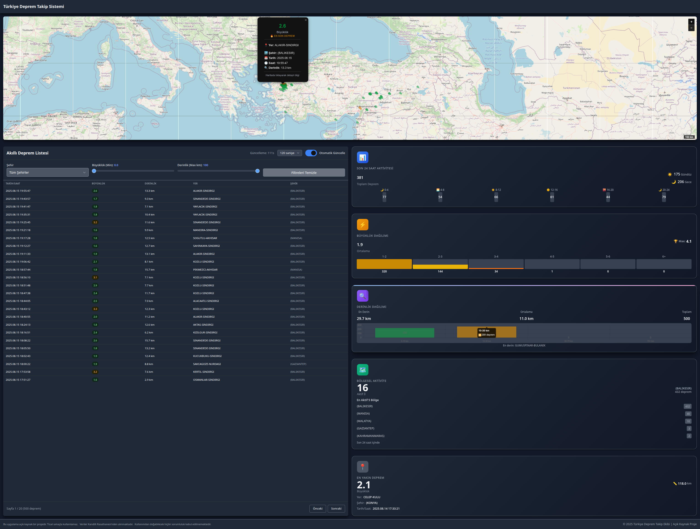

# Sismolog - Türkiye Deprem Takip Sistemi

Bu proje, Türkiye'deki deprem verilerini gerçek zamanlı olarak takip etmek ve görselleştirmek için geliştirilmiş bir web uygulamasıdır.

## Canlı Demo

Projeyi canlı olarak test edebilirsiniz: [https://sismolog-fj13lgl4o-cenktekins-projects.vercel.app](https://sismolog-fj13lgl4o-cenktekins-projects.vercel.app)



## Özellikler

- Kandilli Rasathanesi'nden gerçek zamanlı deprem verileri
- Harita üzerinde deprem konumlarını görselleştirme
- Deprem verilerini filtreleme (büyüklük, şehir, tarih vb.)
- Responsive tasarım
- API endpoints ile veri erişimi

## Teknolojiler

- Frontend: HTML, CSS (Tailwind CSS), JavaScript
- Backend: Node.js, Express.js
- Harita: Leaflet.js
- Template Engine: EJS
- Güvenlik: Helmet, Rate Limiting, Input Validation

## Veri Kaynağı

Bu uygulama, Boğaziçi Üniversitesi Kandilli Rasathanesi ve Deprem Araştırma Enstitüsü'nün resmi web sitesinden (http://www.koeri.boun.edu.tr/scripts/lst0.asp) veri çekmektedir. Veriler, web scraping yöntemi ile alınmakta ve gerçek zamanlı olarak güncellenmektedir.

### Veri Çekme Süreci

1. Kandilli Rasathanesi'nin web sitesine HTTP isteği yapılır
2. Gelen HTML içeriği parse edilir
3. Deprem verileri ayrıştırılır ve yapılandırılır
4. Veriler JSON formatında API üzerinden sunulur

## Kurulum

### Geliştirme Ortamında Çalıştırma

1. Projeyi klonlayın:
```bash
git clone https://github.com/cenktekin/sismolog.git
cd sismolog
```

2. Bağımlılıkları yükleyin:
```bash
npm install
```

3. Uygulamayı başlatın:
```bash
npm start
```

4. Tarayıcıda `http://localhost:3000` adresini açın

### Production Ortamı (Vercel)

Proje otomatik olarak Vercel'e deploy edilir:

**Canlı Uygulama**: https://sismolog-fj13lgl4o-cenktekins-projects.vercel.app

**Vercel Yönetim Paneli**: https://vercel.com/cenktekins-projects/sismolog

#### Otomatik Deploy

Proje GitHub ile entegre edilmiştir. Herhangi bir branch'e push yapılınca otomatik olarak deploy edilir:

```bash
# Değişiklikleri pushlayın
git add .
git commit -m "Update deprem verisi ayrıştırma"
git push origin main
```

#### Vercel Özellikleri

- ✅ **Otomatik Deploy**: Her push'ta otomatik deploy
- ✅ **Rollback**: Eski versiyonlara kolayca geri dönüş
- ✅ **Deploy History**: Tüm deploy geçmişini görme
- ✅ **Environment Variables**: Web arayüzünden yönetim
- ✅ **Performance Analytics**: Performans metrikleri
- ✅ **Custom Domain**: Özel domain ekleme desteği

## API Kullanımı

### Deprem Verilerini Getirme

```http
GET /api/v1/depremler
```

#### Query Parametreleri

- `tarih`: Belirli bir tarihteki depremleri filtreleme
- `min`: Minimum büyüklük
- `max`: Maksimum büyüklük
- `sehir`: Şehir bazlı filtreleme

#### Örnek İstekler

```bash
# Tüm deprem verilerini getir
curl https://sismolog-fj13lgl4o-cenktekins-projects.vercel.app/api/v1/depremler

# 4.0 ve üzeri depremleri getir
curl "https://sismolog-fj13lgl4o-cenktekins-projects.vercel.app/api/v1/depremler?min=4.0"

# Belirli bir şehre ait depremleri getir
curl "https://sismolog-fj13lgl4o-cenktekins-projects.vercel.app/api/v1/depremler?sehir=BALIKESIR"
```

## Güvenlik

- Helmet güvenlik başlıkları
- XSS koruması
- Veri temizleme (mongo-sanitize)
- Rate limiting
- CORS koruması
- Winston logging

## Katkıda Bulunma

Katkılarınızı memnuniyetle karşılıyoruz! Projeye katkıda bulunmak için:

1. Bu projeyi forklayın
2. Yeni bir branch oluşturun (`git checkout -b feature/amazing-feature`)
3. Değişikliklerinizi yapın ve commit edin (`git commit -m 'Add some amazing feature'`)
4. Branch'inizi push edin (`git push origin feature/amazing-feature`)
5. Pull Request oluşturun

## Lisans

Bu proje MIT Lisansı ile lisanslanmıştır - detaylar için [LICENSE](LICENSE) dosyasına bakın.

## Yasal Uyarı

Bu uygulama açık kaynak bir projedir. Ticari amaçla kullanılamaz. Veriler Boğaziçi Üniversitesi Kandilli Rasathanesi ve Deprem Araştırma Enstitüsü'nden alınmaktadır. Kullanımdan doğabilecek hiçbir sorumluluk kabul edilmemektedir.

## İletişim

Proje Geliştirici: Cenk Tekin

Proje Linki: [https://github.com/cenktekin/sismolog](https://github.com/cenktekin/sismolog)
